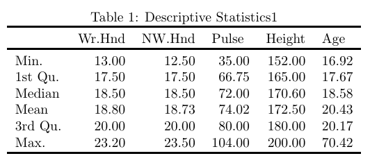
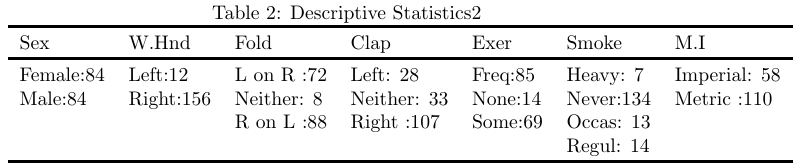

```{r setup, include=FALSE}
knitr::opts_chunk$set(echo = FALSE)
```

# Part 1

#### **1.1 Report descriptive statistics of the data set obtained in (a). **
The descriptive statistics of the data are summarized in the following table.
<div align=center>

<div align=center>


```{r,include=FALSE}
library(MASS)
newdataset = na.omit(survey)
summary(newdataset)
```
```{r,include=FALSE}
Wr.Hnd <- c(13.0,17.5,18.5,18.8,20.0,23.2)
NW.Hnd <- c(12.50, 17.50, 18.50, 18.73, 20.00, 23.50)
Pulse <- c(35.00, 66.75, 72.00, 74.02, 80.00, 104.00)
Height <- c(152.0,165.0,170.6,172.5,180.0,200.0)
Age <- c(16.92, 17.67, 18.58,20.43, 20.17, 70.42)
item <- c('Min.', '1st Qu.', 'Median','Mean','3rd Qu.', 'Max.')
total <- data.frame(item, Wr.Hnd, NW.Hnd,Pulse, Height, Age)
total
```


#### **1.2 Use boxplot to show the distributions of the height of male and female students.**
The distributions of the height of male and female students are as follows.
```{r}
male=subset(newdataset,Sex=='Male')
male_height=male['Height']

female=subset(newdataset,Sex=='Female')
female_height=female['Height']
par(mfrow=c(1,2))

boxplot(male_height,
        main='Distribution of Male Height')
boxplot(female_height,
        main='Distribution of Female Height')

```

#### **1.3 Which numerical variables might have an influence on the student's pulse? **
To indentify variables that have influence on students' pulse, we can conduct regression analysis. By fitting models with "Pulse" as dependent variables and other numerical variables as independent variables respectively, we can easily find that all the numerical variables might have an influence on students' pulse, with p-value of those fitted model all below 0.01.

```{r, include=FALSE}
fit1 <- lm(Pulse~Wr.Hnd, data=newdataset)
summary(fit1)
fit2 <- lm(Pulse~NW.Hnd, data=newdataset)
summary(fit2)
fit3 <- lm(Pulse~Height, data=newdataset)
summary(fit3)
fit4 <- lm(Pulse~Age, data=newdataset)
summary(fit4)
```

#### **1.4 Is the probability of a student clapping his/her left hand on top less than 0.2? **
To make sure whether the probability of a student clapping hand on top less than 0.2, we can use **prop.test** funtion to conduct proportion test. The null hypothesis is that "The probability of a student clapping his/her left hand on top greater than or equal to 0.2", and the alternative hypothesis is that "probability of a student clapping his/her left hand on top less than 0.2". The result suggests that the p-value is 0.1626, which means that we cannot reject the null hypothesis at .1 level of significance. Therefore we can infer that the probability of a student clapping his/her left hand on top is equal to or greater than 0.2.

```{r, include=FALSE}
a <- length(newdataset$Clap)
b <- sum(newdataset$Clap=='Left')
prop.test(b,a,alternative = 'less', p=.2)
```

#### **1.5 Is the span of the writing hand in general larger than the span of the non-writing hand? **
To make sure whether the span of the writing hand in general larger than the span of the non-writing hand, we can make a hypothesis test. The null hypothesis is 'the span of the writing hand is in general smaller than or equal to the span of the non-writing hand', and the alternative hypothesis is 'the span of the writing hand is in general larger to the span of the non-writing hand'. With a p-value of 0.3696, The hypothesis test result suggests that we cannot reject the null hypothesis. Therefore the the span of the writing hand is in general equal to or smaller than the span of the non-writing hand.
```{r, include=FALSE}
t.test(newdataset$Wr.Hnd,newdataset$NW.Hnd,alternative = 'greater')
```

# Part 2 
#### **2.1 According to CLT, what is the approximated distribution of the sample means? **
According to CLT, the means of the sample tends towards a normal distribution. The approximated distribution of the sample means is normal distribution.

```{r, include=FALSE}
newmatrix=matrix(0,nrow=200, ncol=1)
count <- 1
while(count < 200){
  a = rexp(10,5)
  meanvalue=mean(a)
  newmatrix[count,]=meanvalue
  count <- count+1
}
newmatrix
```

#### **2.2 Draw the density plots of the sample means and its approximated distribution on one graph.**
```{r,include=FALSE}
library(sm)
dist <- c(1:400)
dist[1:200] <- newmatrix
dist[201:400]<- rexp(200,5)
tag <- c(rep('1',times=200),rep('2',times=200))
anewdataframe <- data.frame(tag,dist)
tag.f<-factor(tag,levels = c('1','2'), labels=c('mean_value_dist','expo_dist'))
```
```{r}
sm.density.compare(anewdataframe$dist, anewdataframe$tag,xlab='value')
title(main="Density Plot") 
legend("topright",c("sample means distribution", "approximate distribution"),
       lty=c(1, 2), col=c("red", "green"))
```


#### **2.3 Show the qq plot of the distribution of the sample means. **
The QQ plot of the distribution of the sample means is as follows.
```{r}
qqnorm(newmatrix)
```

#### **2.4 What conclusion can you draw from this simulation?**
From the density plot, we can know that the sample means distribution tends towards normal distribution as the sample means number get greater. From QQ plot, we can also observe that the points fall on the straight 45-degree line, which suggests that the residual values are normally distributed with a mean of 0. Hence the sample means are normally distributed.

# Part 3
#### **3.1 Draw 5000 random samples of X.**
The random samples generated are omitted here.
```{r,include=FALSE}
matrix1<- matrix(0,5000,1)
count1 <-1
while(count1 < 5000){
  if (runif(1)<0.75){
    matrix1[count1,]=rt(1,df=4);
    count1=count1+1
  }else{if(runif(1)<0.6){
    matrix1[count1,]<- rexp(1,2)}else{
    matrix1[count1,]<- runif(1,-3,3)};
    count1=count1+1}
}
plot(density(matrix1),main='Density Plot')
```

#### **3.2 Given $\alpha$ = 0.05, find the VaR of the samples obtained in a). **
Since VaR denotes the critical value $L$ such that $P(X>L)=\alpha$ ,to find the VaR of the samples, we first need to sort the array of the change of the stock price ascendingly. Then we can use **quantile** function to find out the change value situated at given $\alpha$. The VaR is -2.188176.
```{r,include=FALSE}
sort(matrix1)
VaR=quantile(matrix1,.05)
```

#### **3.3 Find the CVaR of the samples obtained in a). **
CVaR is the average loss over a specified time period of unlikely scenarios beyond the confidence level. By calculating the arithmetic mean of rate of return under the critical value L, we can find that the CVAR is -3.128548 in this case. 

# Part 4
#### **4.1 Report on  data exploration.**
```{r}
newdata <- read.csv(file='customer_analysis.csv')
plot(density(newdata$Purchase),main = 'Distribution of Purchase')

par(mfrow=c(1,2))
num1<- sum(newdata=='F')
num2<- sum(newdata=='M')
slices<- c(num1,num2)
lbls <- c('Female','Male')
pct <- round(slices/sum(slices)*100)
lbls2<-paste(lbls,' ', pct,'%',sep = '')
pie(slices, labels=lbls2, col=rainbow(length(lbls2)), main='Pie Chart for Gender')

num1<- sum(newdata$Marital_Status==1)
num2<- sum(newdata$Marital_Status==0)
slices <- c(num1,num2)
lbls <- c('Married','Unmarried')
pct <- round(slices/sum(slices)*100)
lbls2<-paste(lbls,' ', pct,'%',sep = '')
pie(slices, labels = lbls2,col=rainbow(length(lbls2)), main='Pie Chart for Marital Status')

num1<- sum(newdata=='18-25')
num2<- sum(newdata=='26-35')
num3<- sum(newdata=='36-45')
num4<- sum(newdata=='46-50')
num5<- sum(newdata=='51-55')
num6<- sum(newdata=='55+')
slices<- c(num1,num2,num3,num4,num5,num6)
lbls <- c('18-25','26-35','36-45','46-50','51-55','55+')
pct <- round(slices/sum(slices)*100)
lbls2<-paste(lbls,' ', pct,'%',sep = '')
pie(slices,lbls2,col=rainbow(length(lbls2)), main='Pie Chart for Age')

num1<- sum(newdata=='A')
num2<- sum(newdata=='B')
num3<- sum(newdata=='C')
slices <-c(num1,num2,num3)
lbls<- c('city A','city B','city C')
pct <- round(slices/sum(slices)*100)
lbls2<-paste(lbls,' ', pct,'%',sep = '')
pie(slices,lbls2,col=rainbow(length(lbls2)), main='Pie Chart for City')

num1<- sum(newdata$Stay_In_Current_City_Years==0)
num2<- sum(newdata$Stay_In_Current_City_Years==1)
num3<- sum(newdata$Stay_In_Current_City_Years==2)
num4<- sum(newdata$Stay_In_Current_City_Years==3)
num5<- sum(newdata$Stay_In_Current_City_Years=='4+')
slices<- c(num1,num2,num3,num4,num5)
lbls<- c('0 year','1 year','2 years','3years','4+ years')
pct <- round(slices/sum(slices)*100)
lbls2<-paste(lbls,' ', pct,'%',sep = '')
pie(slices, labels = lbls2, col=rainbow(length(lbls2)), main = 'Pie Chart for Stay-in-current-city Years')
```

#### **4.2 Report on modeling (baseline model and alternatives).**


#### **4.3 Report on results and interpretation of the fitted model.**


#### **4.4 Report on model assumptions.**